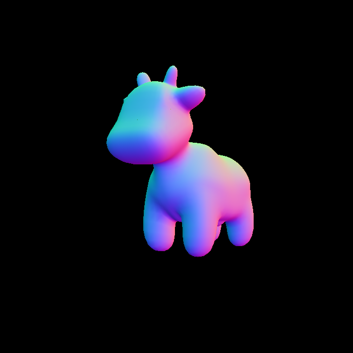
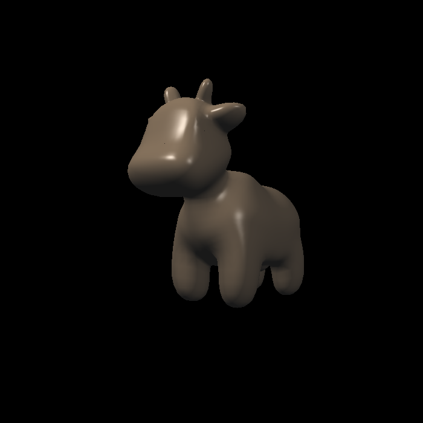
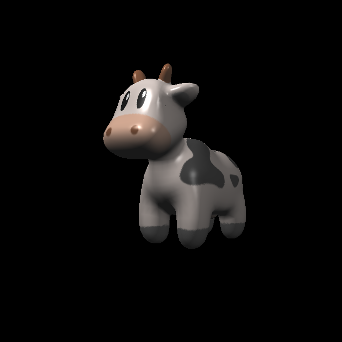

# HW4 Report

Resulting images:\
\
\

* In `rasterizer.cpp`, I modified `rasterize_triangle()` by first copying over the code from HW3.

  * I replaced `w_reciprocals` and `z_interpolated` with the given code that computes `Z` and `zp`. Then, if the current `zp` is smaller than `depth_buf[idx]`, meaning it's closer to the screen, and therefore should be painted, I interpolated the color, normal, texture coordinates, and the shading coordinates using the given `interpolate()` function. After that, I used the given code to pass the color to the shaders to get `pixel_color`, and set it to the pixel using `set_pixel()`. The depth buffer is updated to `zp` at `depth_buf[idx]`.

* In `main.cpp`, I modified `phong_fragment_shader()` and `texture_fragment_shader()`.

  * In `phong_fragment_shader()`, I computed the ambient component `L_a`, the diffuse component `L_d`, and the specular component `L_s`, following the Blinn-Phong Reflectance Model. The 3 components are all added to `result_color`. Ambient is computed by multiplying the `ka` coefficient to `amb_light_intensity`, according to `L_a = k_a * I_a`. Diffuse is computed according to formula `L_d = k_d * (I/r^2) * max(0, n·l)`, and Specular according to `L_s = k_s * (I/r^2) * max(0,n·h)^p` and `h = (v+l)/(v+l).norm()`. I used `.cwiseProduct()` to multiply coefficients `ka`, `kd`, `ks` to the vectors in the formulas. I normalized the light vector, the normal vector, and the view vector.

  * In `texture_fragment_shader()`, I copied over the Blinn-Phong code from `phong_fragment_shader()` and added code for `texture_color`. `payload` has a pointer to its `Texture`. `getColor()` is used to get the fragment's texture value. Texture coordinates are accessed from `payload.tex_coords`.
