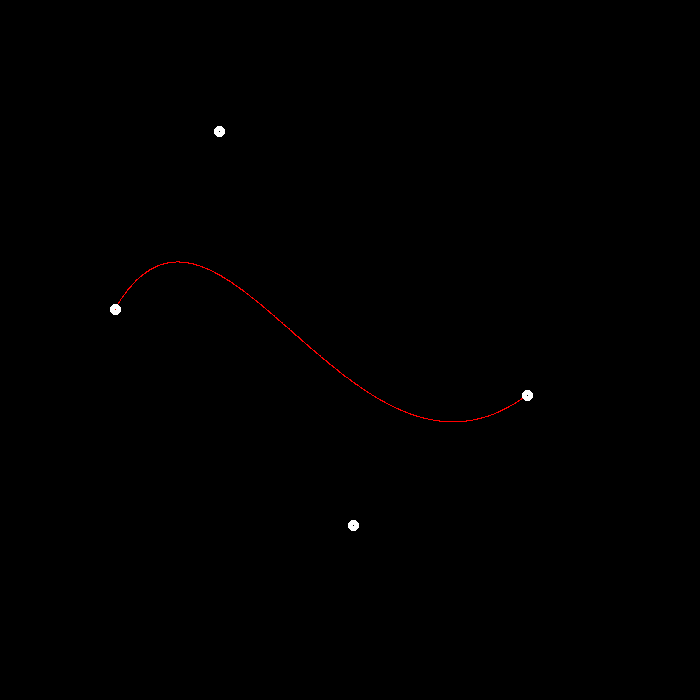
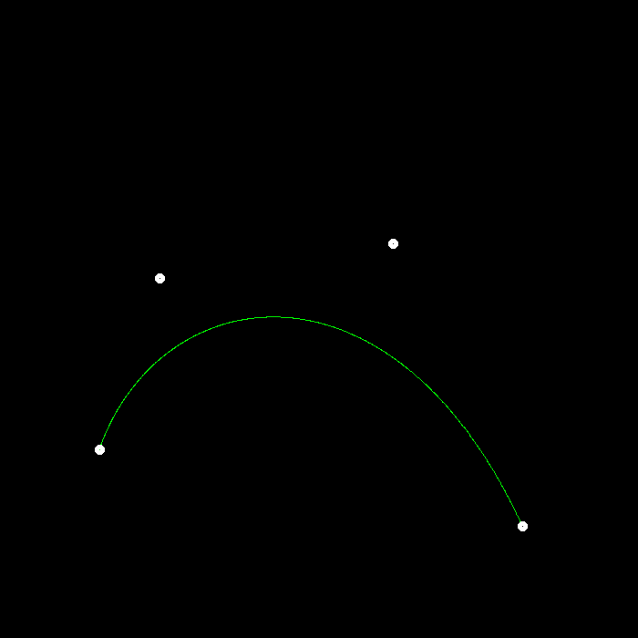
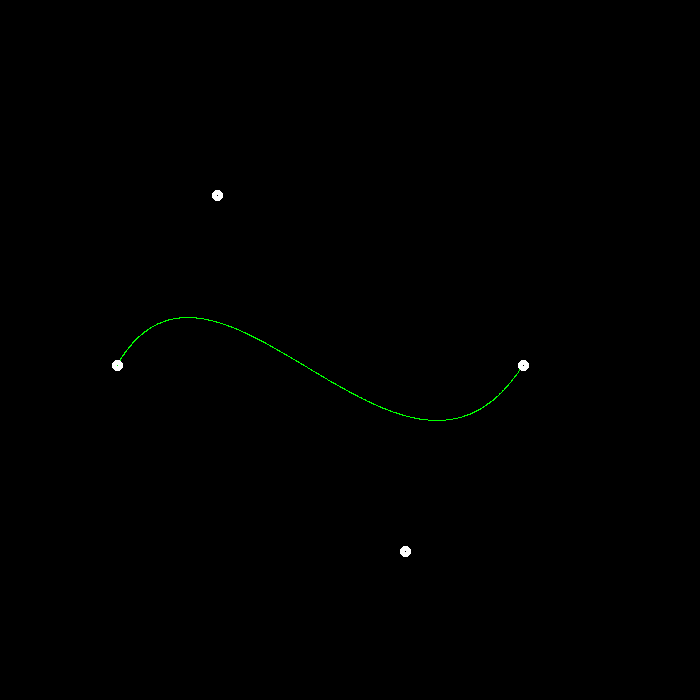
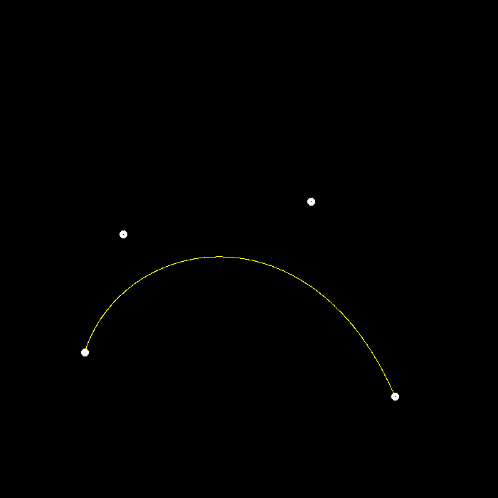
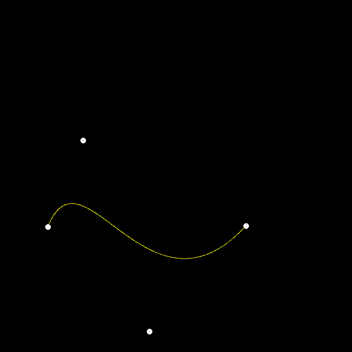

# HW5 Report

Resulting images:\
\
\
\
\
\

I modified the `bezier()` and `recursive_bezier()` in `main.cpp`.
In `bezier(const std::vector<cv::Point2f> &control_points, cv::Mat &window)`, like in `naive_bezier()`, I increment `t` by 0.001. Then, in each loop, I call `recursive_bezier()` where De Casteljau’s Algorithm is implemented.

In `recursive_bezier(const std::vector<cv::Point2f> control_points, float t)`, I recursively subdivide each line segment using `lerp()` until there is only 1 point left, which is what we want to return.
