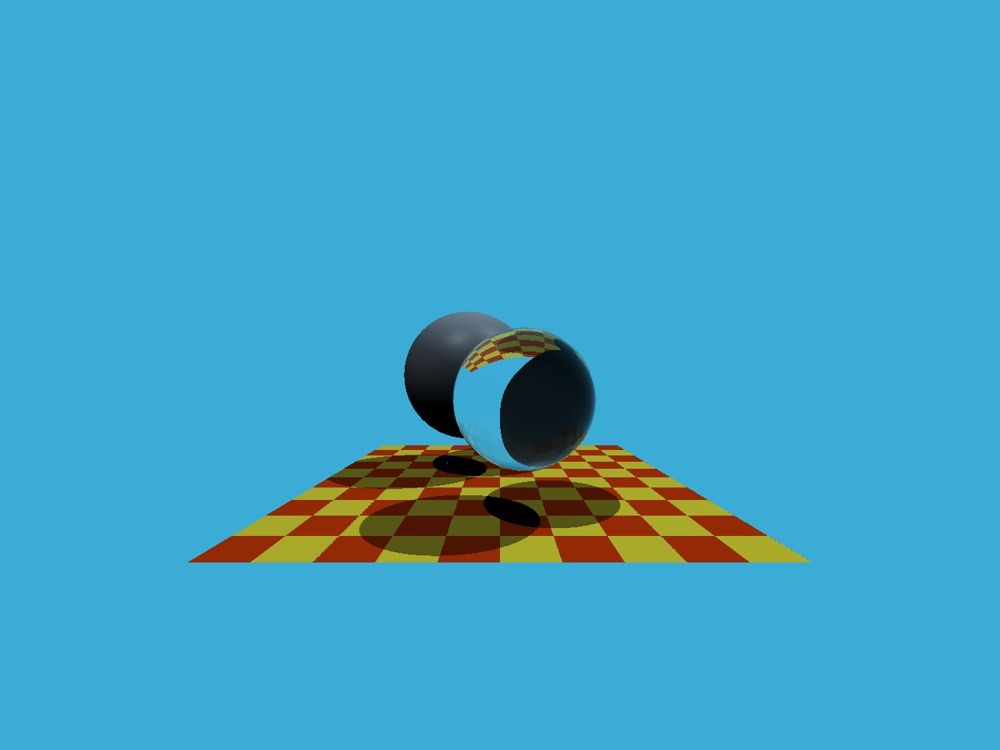

# HW6 Report

Result image:\

I modified `Renderer.cpp` and `Triangle.hpp`.

In `Render(const Scene& scene)`, I calculate the `x` and `y` positions by scaling `i` and `j` from a range of [-1, -1] to [0, 1]. Then, I used `x` and `y` to generate the primary ray direction vector (normalized) for the `castRay(...)` function to get the pixel color, which is saved in the framebuffer.

I implemented `rayTriangleIntersect(...)` according to the slide from Lecture 16. The resulting tnear, u, v values are barycentric coordinates, so `(1 - u - v) >= 0`, `0 <= u, v <= 1`, and `tnear >= 0` is the condition for when the ray intersects with the triangle.
